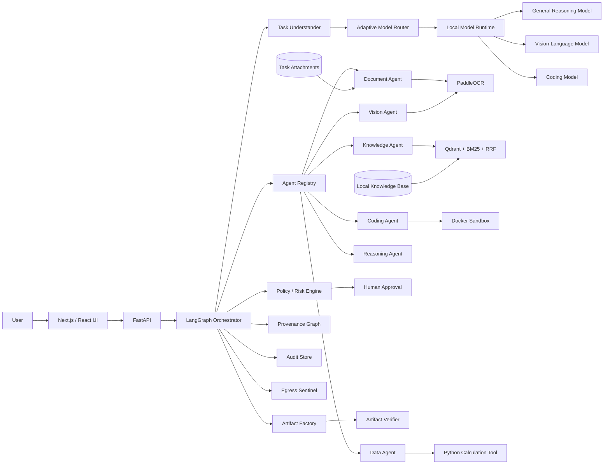

# Overall Architecture

## 1. High-level system



## 2. Layer boundaries

### Presentation
Owns:
- chat/task input
- file upload
- plan display
- approval UI
- execution timeline
- evidence view
- artifacts
- audit/egress view

It must not contain model-selection logic.

### API
Owns:
- authentication/session boundary
- request validation
- task creation
- file metadata
- streaming task events

### Orchestration
LangGraph owns the state machine:

```text
understand
→ risk_assess
→ route
→ plan
→ policy_check
→ approval_interrupt
→ execute
→ observe
→ replan
→ verify
→ deliver
```

### Model layer
Agents ask for capabilities, not model IDs.

```text
Agent → ModelRouter → ModelProfile → Local Runtime
```

### Agent layer
Each agent has:
- capability descriptor
- allowed tools
- input/output contracts
- security classification
- retry policy

### Tool layer
Tools are explicit, registered and policy checked.

### Data layer
Separate:
- task/session data
- persistent organizational knowledge
- generated artifacts
- audit records
- provenance records

## 3. Key invariant

No agent may call a model by a hard-coded provider/API.

Bad:

```python
client.chat(model="some-model")
```

Good:

```python
model = model_router.resolve(
    capability="document_reasoning",
    modality=["text", "image"],
    task_risk="high",
)
```

## 4. Sovereignty boundary

Normal runtime must use:
- localhost/private LAN model endpoints
- local OCR
- local embedding
- local vector database
- local artifact storage
- local sandbox

No cloud API keys are required for the normal path.

## 5. Hardware-aware operation

The system must support:
- one small GPU
- sequential model loading
- quantized models
- CPU fallback for non-LLM utilities
- larger local servers later

The model router must reject a model that does not fit the configured hardware budget rather than causing an uncontrolled OOM.

## 6. Failure boundary

Every external-to-agent action is observable:

```text
tool_call_started
tool_call_completed
tool_call_failed
model_selected
model_failed
policy_decision
approval_requested
approval_received
artifact_created
artifact_verified
egress_blocked
egress_observed
```
