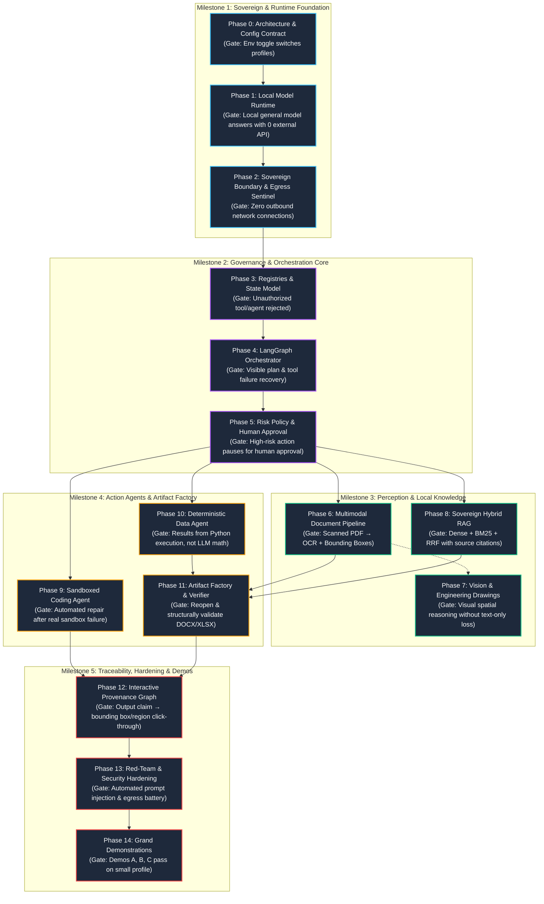
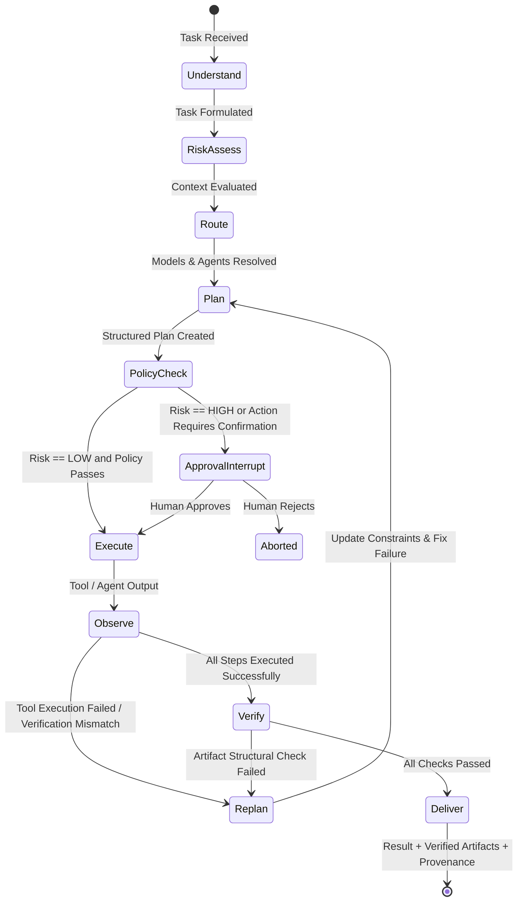
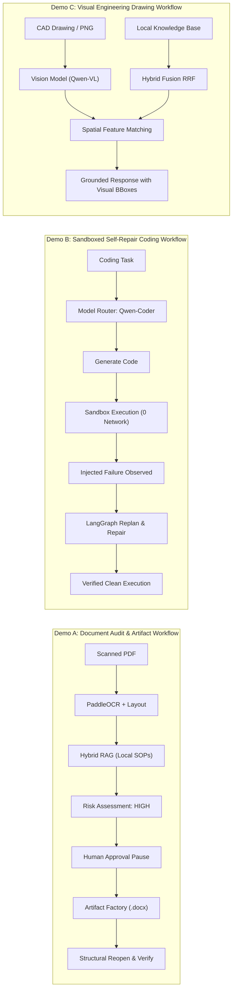

# Sovereign Workbench: Phase Workflow & Execution Architecture

This document specifies the end-to-end workflow detailing both the **Implementation Lifecycle (Build Pipeline)** and the **Real-Time Runtime Execution Workflow (What the System Looks Like in Action)**.

---

## 1. High-Level Phase Roadmap & Dependency Flow

The 15 phases (Phase 0 to Phase 14) are organized into 5 progressive milestones. Progression is governed by strict exit gates; no phase commences until the preceding gate has verified acceptance tests.



---

## 2. Phase-by-Phase Build & Gate Enforcement Matrix

Every phase follows a rigid development lifecycle: **Implement Components → Run Acceptance Tests → Gate Check → Advance**.

| Phase | Core Objective | Key Deliverables Built | Gate Verification Criteria (Automated) |
|---|---|---|---|
| **P0: Config & Architecture** | Abstraction contracts | Settings loader, `ModelProfile` schema, Agent/Tool schemas | Toggle `USE_HIGH_LEVEL_MODELS=true/false` swaps models with zero agent code changes. |
| **P1: Local Runtime** | Local inference engine | vLLM / OpenAI-compatible adapter, VRAM probe, health check | API generates valid inference response with 0 cloud dependencies. |
| **P2: Sovereign Boundary** | Strict air-gap assurance | Docker network isolation (`internal: true`), Egress Sentinel | Automated network monitor captures zero outbound SYN packets during active task run. |
| **P3: Registries & State** | Controlled capability binding | `AgentRegistry`, `ToolRegistry`, immutable task session state | Unauthorized agent requesting forbidden tool gets rejected at validation layer. |
| **P4: LangGraph Engine** | Stateful task orchestration | 11 LangGraph nodes, state persistence, dynamic replanning | Synthetic task with injected tool fault triggers replanner and succeeds on retry. |
| **P5: Risk & Approval** | Human-in-the-loop governance | Risk classifier (`LOW` to `CRITICAL`), policy interrupt hook | Execution state freezes at `approval_interrupt` until human approves via API/UI. |
| **P6: Multimodal Pipeline** | Raw document normalization | PaddleOCR, layout analyzer, table extractor, VLM reasoning | Scanned PDF returns normalized evidence objects with bounding coordinates and confidence. |
| **P7: Vision Workflow** | Engineering drawing perception | Spatial coordinate observer, tag extraction, visual citation | Blueprint query resolves visual element tags without lossy text-only conversion. |
| **P8: Sovereign RAG** | Deterministic citation search | Qdrant vector store, local BM25, Reciprocal Rank Fusion (RRF) | Ground-truth retrieval query returns correct document name and exact page number. |
| **P9: Sandboxed Coding** | Resilient code generation | Zero-network Docker container, test harness, repair loop | Synthetically failed test triggers agent introspection, self-repair, and verified execution. |
| **P10: Data & Calculation** | Hallucination-free math | Sandboxed Pandas/Python tool, calculation step trace | Final numeric answers derive strictly from Python tool outputs with traceable formulas. |
| **P11: Artifact Factory** | Verified output generation | DOCX & XLSX template renderers, file structure validator | Generated DOCX/XLSX is re-opened, schema-validated, and verified before delivery. |
| **P12: Provenance Graph** | End-to-end evidence graph | Directed Acyclic Graph: Output Claim → Source Doc → Page → Region | Reviewer can click any claim in UI and display matching document crop and tool receipt. |
| **P13: Red-Team & Tests** | Security & stability proof | Prompt injection suite, egress fuzzing, container breakout tests | 100% of acceptance matrix items (A01–A24) automated and passing. |
| **P14: Grand Demos** | End-to-end mission delivery | Demos A (Report to DOCX), B (Code Self-Repair), C (Drawing VLM) | All 3 demos run end-to-end on local small model profile (`USE_HIGH_LEVEL_MODELS=false`). |

---

## 3. The Runtime Execution Workflow: How the System Operates

Once assembled, the phases materialize as an intelligent, secure, LangGraph-governed task execution pipeline:

```mermaid
sequenceDiagram
    autonumber
    actor User as User / Operator
    participant UI as Next.js Sovereign UI
    participant API as FastAPI Gateway
    participant LG as LangGraph Orchestrator (Phase 4)
    participant POL as Risk & Policy Engine (Phase 5)
    participant ROUTER as Model Router (Phase 0, 1)
    participant AGENTS as Specialized Agents (Phase 3, 6-10)
    participant SB as Docker Sandbox (Phase 2, 9, 10)
    participant ART as Artifact Factory (Phase 11)
    participant PROV as Provenance & Audit Store (Phase 3, 12)
    participant SENT as Egress Sentinel (Phase 2, 13)

    User->>UI: Submit Task (e.g. Scanned Report + SOP Query)
    UI->>API: POST /api/tasks (Payload + Attachments)
    API->>LG: Initialize Task State Graph
    
    rect rgb(30, 41, 59)
        note over LG, POL: Step 1: Understand, Route & Risk Assessment
        LG->>LG: node_understand()
        LG->>ROUTER: Resolve model (modality=['text','image'], risk='HIGH')
        ROUTER-->>LG: Active Model Profile (Qwen3-VL-4B-Instruct)
        LG->>POL: node_risk_assess()
        POL-->>LG: Risk: HIGH (Modifies persistent artifact / SOP compliance)
        LG->>LG: node_plan() -> Create dynamic execution DAG
    end

    rect rgb(59, 43, 30)
        note over LG, UI: Step 2: Policy Interruption & Human Approval
        LG->>LG: node_policy_check()
        LG->>UI: Emit event: APPROVAL_REQUESTED (Plan & Risk Analysis)
        User->>UI: Review Plan & Click "Approve Execution"
        UI->>API: POST /api/tasks/{id}/approve
        API->>LG: Resume Graph Execution
    end

    rect rgb(20, 50, 40)
        note over LG, SB: Step 3: Multi-Agent Parallel Execution
        LG->>AGENTS: Delegate to Document Agent (Phase 6)
        AGENTS->>AGENTS: PaddleOCR + Layout Analysis + Bounding Boxes
        LG->>AGENTS: Delegate to Knowledge Agent (Phase 8)
        AGENTS->>AGENTS: Hybrid Search (Qdrant + BM25 + RRF)
        LG->>AGENTS: Delegate to Data / Coding Agent (Phase 9, 10)
        AGENTS->>SB: Execute Python Calculation / Code in Zero-Network Container
        SENT->>SENT: Monitor Network Interfaces (Verify 0 Outbound Packets)
        SB-->>AGENTS: Deterministic Math Trace / Verified Code
        AGENTS-->>LG: Return Evidence Objects & Verified Traces
    end

    rect rgb(45, 30, 60)
        note over LG, ART: Step 4: Verification, Artifacts & Provenance
        LG->>ART: node_delivery() -> Generate Approval Note (.docx)
        ART->>ART: Re-open file, validate XML integrity & structure
        LG->>PROV: Compile Provenance Graph (Claims -> Source Bounding Box -> Task ID)
        PROV-->>UI: Push live telemetry & Provenance Node Map
    end

    LG->>UI: Stream FINAL_DELIVERY (Verified Document + Provenance Graph)
    UI->>User: Display Result with Interactive Evidence Click-Through
```



---

## 4. LangGraph State Machine Workflow

The internal state graph executes the following lifecycle. Dynamic edges determine whether to pause for human approval, recover from failed tool calls, or deliver validated artifacts.



---

## 5. What the Workbench Looks Like (UI/UX Interface Specification)

The Sovereign Workbench presentation layer is divided into five purpose-built operational panels:

```text
+--------------------------------------------------------------------------------------------------------------+
| [SOVEREIGN SENTINEL] 🟢 ZERO EGRESS (0B/s Out) | PROFILE: SMALL (Local vLLM) | VRAM: 11.4GB / 16GB [OK]      |
+--------------------------------------------------------------------------------------------------------------+
| TASK: Scanned Inspection Audit #TASK-802 | STATUS: EXECUTING (STEP 4/6) | RISK LEVEL: HIGH [APPROVAL: GRANTED] |
+--------------------------------------+-----------------------------------------------------------------------+
|  LEFT PANEL: WORKFLOW & CHAT         |  RIGHT PANEL: MULTI-INSPECTOR WORKBENCH                               |
|                                      |  [Tabs: 🗺️ Provenance | 📄 Evidence | 📦 Artifact | 🛡️ Security Audit] |
| 1. Understand Request [✓]            +-----------------------------------------------------------------------+
| 2. Risk Assessment: HIGH [✓]         | EVIDENCE INSPECTION & BOUNDING BOX VIEWER:                             |
| 3. Model Routing: Qwen3-VL-4B [✓]    |                                                                       |
| 4. Human Approval: Granted by Admin  | +-----------------------------+  Page 4: Vibration Tolerance Table   |
| 5. Multimodal OCR & Layout [ACTIVE]  | | [Document Viewer]           |  -----------------------------------  |
|    - Extracted 4 Tables              | |                             |  Extracted Value: "0.42 mm/s"         |
|    - 2 Out-of-spec findings found    | |  +-----------------------+  |  OCR Confidence: 99.4%                |
| 6. Hybrid RAG (SOP-09 Retrieval) [..]| |  | Bounding Box: Table 2 |  |  Status: NON-COMPLIANT (Max: 0.35)    |
| 7. Generate & Verify DOCX [Pending]  | |  | [0.42 mm/s]           |  |                                       |
|                                      | |  +-----------------------+  |  PROVENANCE TRACE:                    |
| > "Agent: Document Agent processed   | |                             |  Claim: "Exceeds tolerance limit"     |
|    page 4. Findings logged. Now      | +-----------------------------+    → Ref: SOP-09 Section 3.2          |
|    querying SOP for standard         |                                    → Tool: PaddleOCR (BBox: 120,44,80) |
|    operating deviation protocol."    |                                    → Agent: DocumentAgent              |
|                                      |                                    → Model: Qwen3-VL-4B                |
+--------------------------------------+-----------------------------------------------------------------------+
| [INPUT: Type additional instruction...]                                        [⚙️ Settings] [🛑 Abort Task]  |
+--------------------------------------------------------------------------------------------------------------+
```

### Detailed View Descriptions:

1. **Sovereign Status Header**:
   - Always visible at the top of the interface.
   - Shows live telemetry from the **Egress Sentinel** (`0 bytes outbound`), verifying full offline air-gap status.
   - Displays hardware budget metrics: active model profile (`SMALL` vs `HIGH`), local VRAM saturation, and inference latency.

2. **Execution Timeline & Step Tracker**:
   - Live visual representation of the active LangGraph execution graph.
   - Displays real-time agent delegation, tool invocations, and replanning iterations.
   - Distinct visual state for **Approval Interrupt** with side-by-side impact analysis.

3. **Evidence & Provenance Inspector**:
   - Split-screen visual verification showing original uploaded documents/drawings alongside OCR text.
   - Clickable bounding boxes highlight exactly where numbers or visual tags were extracted.
   - Direct click-through from generated claim in final summary to source document, page, and visual coordinates.

4. **Artifact Verifier Modal**:
   - Inspects generated `.docx`, `.xlsx`, or code files.
   - Visual badges verify:
     - Structural integrity (reopened and parsed by native office engines without errors).
     - Calculation integrity (all numbers mapped directly to deterministic Python execution traces).

5. **Security & Audit Console**:
   - Immutable log of all events (`tool_call_started`, `policy_decision`, `egress_check`).
   - Sandbox status: Container ID, memory limit, network isolation confirmation (`internal: true`).

---

## 6. Demonstration Workflow Profiles (Phase 14 Realization)

The complete pipeline culminates in three verifiable demonstrations proving full end-to-end functionality:



---

## 7. Development Discipline & Validation Commands

To advance through the phases during development, run the automated acceptance test suite for each respective exit gate:

```bash
# Verify Phase 0: Profile switching
pytest tests/acceptance/test_p0_config.py -v

# Verify Phase 1: Local runtime answering
pytest tests/acceptance/test_p1_runtime.py -v

# Verify Phase 2: Zero egress validation
pytest tests/acceptance/test_p2_sovereignty.py -v

# Verify Phase 4: LangGraph replanning & recovery
pytest tests/acceptance/test_p4_orchestration.py -v

# Verify Phase 5: High-risk approval interrupt
pytest tests/acceptance/test_p5_risk_approval.py -v

# Run full acceptance matrix (A01 - A27)
pytest tests/acceptance/test_matrix.py -v
```
